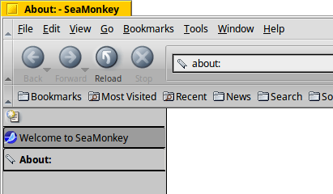

# Gray Modern Revived SeaMonkey Theme



## Features
Themes has been updated to work with SeaMonkey version 2.49.1
- Bug fixes: unable to reply, unable to send mail, unable to save draft etc;
- Added missing grayscale button graphics
- Add missing grayscale envelope graphic for "Mail & Newsgroups"
- Restore original colored toolbar buttons
- Restore original Mozilla throbber

## Install
```git clone https://github.com/metsatron/graymodern-revived-mozilla.org.git ~/.mozilla/seamonkey/**.default/extensions/graymodern-revived@mozilla.org/```
